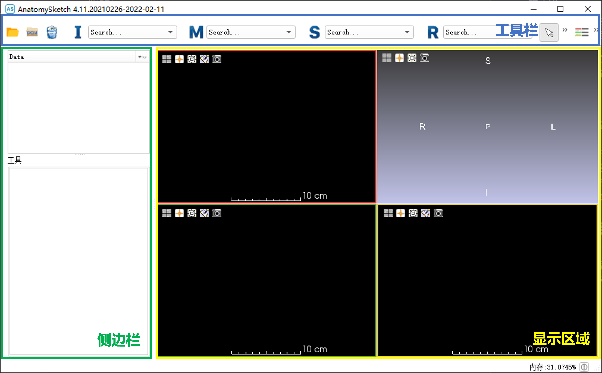

&emsp;&emsp;*本软件为[**大连理工大学医学影像研究组**](http://biomedimg-dlut-edu.cn/index.html)自研的医学图像分析软件 Anatomy Sketch (AS) 的 2.0 版本。本软件基于开源软件 [Slicer](https://www.slicer.org/) 框架开发，按照 AS 1.0 的用户界面进行重构，并且制作了中文操作界面,方便国内用户使用。本软件的目的是为科研同行提供便利工具，并非专业软件公司出品，软件设计难免有瑕疵，还请广大用户包涵并积极反馈改进建议，我们会第一时间回复并尽快修改。联系我们可以发邮件至mingruizhuang@foxmail.com，欢迎感兴趣的同行来信一起加入开源软件的开发团队。*

# 1 目录

- [1 目录](#1-目录)
- [2 软件简介](#2-软件简介)
- [3 浏览医学图像数据](#3-浏览医学图像数据)
  - [3.1 软件主界面](#31-软件主界面)
  - [3.2 导入数据](#32-导入数据)
  - [3.3 浏览3D数据](#33-浏览3d数据)
  - [3.4 图像属性](#34-图像属性)
  - [3.5 多幅图像的叠加显示](#35-多幅图像的叠加显示)
  - [3.6 显示控制](#36-显示控制)
- [4 数据标记（Data Markups）](#4-数据标记data-markups)
  - [4.1 图像分割（Image Segmentation）](#41-图像分割image-segmentation)
  - [4.2 轮廓线（Contour）](#42-轮廓线contour)
  - [4.3 包围盒（Bounding Box）](#43-包围盒bounding-box)
  - [4.4 标定点（Landmark）](#44-标定点landmark)
- [5 插件扩展功能](#5-插件扩展功能)
  - [5.1 创建插件模板](#51-创建插件模板)
  - [5.2 scriptedcli插件修改](#52-scriptedcli插件修改)
  - [5.3 scripted插件修改](#53-scripted插件修改)
  - [5.4 插件移植到AS](#54-插件移植到as)
  - [5.5 内嵌环境安装其它库](#55-内嵌环境安装其它库)
  - [5.6 插件调用Anaconda环境](#56-插件调用anaconda环境)
- [6 其他功能](#6-其他功能)
- [6.1 命令行启动AS](#61-命令行启动as)
- [6.2 体绘制(Volume Rendering)](#62-体绘制volume-rendering)
- [7 图像处理](#7-图像处理)
  - [7.1 图像对比（Compare Volumes）](#71-图像对比compare-volumes)
  - [7.2 调整图像尺寸（脑部）（Resize Image (BRAINS)）](#72-调整图像尺寸脑部resize-image-brains)
  - [7.3 图像裁剪（Crop Volume）](#73-图像裁剪crop-volume)
  - [7.4 一般滤波（SimpleFilter）](#74-一般滤波simplefilter)
    - [7.4.1 简介](#741-简介)
    - [7.4.2 滤波选项](#742-滤波选项)
    - [7.4.3 参数集合](#743-参数集合)
    - [7.4.4 实施滤波](#744-实施滤波)
    - [7.4.5 滤波器与对应的简介](#745-滤波器与对应的简介)
  - [7.5 变换（Transforms）](#75-变换transforms)
    - [7.5.1 概述](#751-概述)
    - [7.5.2 变换数据的创建](#752-变换数据的创建)
    - [7.5.3 将变换作用在图像上](#753-将变换作用在图像上)
    - [7.5.4 编辑变换](#754-编辑变换)
    - [7.5.5 变换的可视化](#755-变换的可视化)
    - [7.5.6 变换数据的转换与导出](#756-变换数据的转换与导出)
  - [7.6 图像标签组合（Image Label Combine）](#76-图像标签组合image-label-combine)
  - [7.7 标签统计（Label Statistics）](#77-标签统计label-statistics)
  - [7.8 直方图匹配（Histogram Matching）](#78-直方图匹配histogram-matching)
    - [7.8.1 概述](#781-概述)
    - [7.8.2 用例](#782-用例)
    - [7.8.3 面板及其使用](#783-面板及其使用)
  - [7.9 PET的标准摄取值计算（PET Standard Uptake Value Computation）](#79-pet的标准摄取值计算pet-standard-uptake-value-computation)
    - [7.9.1 概述](#791-概述)
    - [7.9.2 用例](#792-用例)
    - [7.9.3 面板及其使用](#793-面板及其使用)
  - [7.10 图像运算（Arithmetic）](#710-图像运算arithmetic)
    - [7.10.1 灰度图像相加（Add Scalar Volumes）](#7101-灰度图像相加add-scalar-volumes)
    - [7.10.2 灰度直方裁剪（Cast Scalar Volumes）](#7102-灰度直方裁剪cast-scalar-volumes)
    - [7.10.3 体积图像遮罩（Mask Scalar Volumes）](#7103-体积图像遮罩mask-scalar-volumes)
    - [7.10.4 标量容积相乘（Multiply Scalar Volumes）](#7104-标量容积相乘multiply-scalar-volumes)
    - [7.10.5 标量容积相减（Subtract Scalar Volumes）](#7105-标量容积相减subtract-scalar-volumes)
  - [7.11 去噪（Denoising）](#711-去噪denoising)
    - [7.11.1 中值滤波（Median Image Filter）](#7111-中值滤波median-image-filter)
    - [7.11.2 高斯模糊图像滤波器（Gaussian Blur Image Filter）](#7112-高斯模糊图像滤波器gaussian-blur-image-filter)
    - [7.11.3 梯度各向异性扩散（Gradient Anisotropic Diffusion）](#7113-梯度各向异性扩散gradient-anisotropic-diffusion)
    - [7.11.4 曲率各向异性扩散（Curvature Anisotropic Diffusion）](#7114-曲率各向异性扩散curvature-anisotropic-diffusion)
  - [7.12 形态学（Morphology）](#712-形态学morphology)
    - [7.12.1 灰度图像孔洞填充（Grayscale Fill Hole Image Filter）](#7121-灰度图像孔洞填充grayscale-fill-hole-image-filter)
    - [7.12.2 灰度图像去除峰值（Grayscale Grind Peak Image Filter）](#7122-灰度图像去除峰值grayscale-grind-peak-image-filter)
    - [7.12.3 二值图像投票孔洞填充（Voting Binary Hole Filling Image Filter）](#7123-二值图像投票孔洞填充voting-binary-hole-filling-image-filter)
- [8 模型处理（Model Processing）](#8-模型处理model-processing)
  - [8.1	灰度数据制作（Grayscale Model Maker）](#81灰度数据制作grayscale-model-maker)
  - [8.2	合并模型（Merge model）](#82合并模型merge-model)
  - [8.3 模型制作（Model maker）](#83-模型制作model-maker)
  - [8.4 带模型的探头容积（Probe volume with model）](#84-带模型的探头容积probe-volume-with-model)
- [9 分割（Segmentation）](#9-分割segmentation)
  - [9.1 区域标注（Region Annotation）](#91-区域标注region-annotation)
    - [9.1.1 阈值分割样例（Threshould  Segmentation Example）](#911-阈值分割样例threshould--segmentation-example)
    - [9.1.2 种子生长分割样例（Seed Growth Segmentation Example）](#912-种子生长分割样例seed-growth-segmentation-example)
  - [9.2 简单区域增长分割（Simple Region Growing Segmentation）](#92-简单区域增长分割simple-region-growing-segmentation)
  - [9.3 分割统计（Segment Statistics）](#93-分割统计segment-statistics)
    - [9.3.1 标签映射统计（Labelmap statistics）](#931-标签映射统计labelmap-statistics)
    - [9.3.2 标量容积统计（Scalar volume statistics）](#932-标量容积统计scalar-volume-statistics)
    - [9.3.3 闭合曲面统计（Closed surface statistics）](#933-闭合曲面统计closed-surface-statistics)
- [10 配准（Registration）](#10-配准registration)
  - [10.1 标定点配准（Landmark Registration）](#101-标定点配准landmark-registration)
  - [10.2 通用配准（General Registration，BRAINS）：全脑3D图像的互信息配准。](#102-通用配准general-registrationbrains全脑3d图像的互信息配准)
  - [10.3 基准配准（Fiducial Registration）：从配准的基准列表计算刚性、相似性或仿射变换。](#103-基准配准fiducial-registration从配准的基准列表计算刚性相似性或仿射变换)
  - [10.4 度量测试（Metric Test）：比较两个输入图像和可能的输入BSpline变换的Mattes/MSQ度量值。](#104-度量测试metric-test比较两个输入图像和可能的输入bspline变换的mattesmsq度量值)

# 2 软件简介

Anatomy Sketch （简称AS）软件是[**大连理工大学医学影像研究组**](http://biomedimg-dlut-edu.cn/index.html)
开发的一款医学图像分析开源软件，旨在为科研同行提供便利工具。在医学图像的研究过程中，经常需要对图像进行一些浏览、处理和标记。AS想要作为一种简洁且拓展性强的工具箱软件来满足这种需求。

AS软件提供了基础的医学图像浏览和处理功能，主要包括：

- 多种格式二维和三维医学影像的浏览与可视化。
- 器官模型和曲面的浏览。
- 基本的图像和图形处理功能。包括针对三维图像（Image）和表面模型（Mesh）的多种处理功能。
- 图像分割。软件内置了四种图像分割方法，其中包括两种交互式分割方法，可以在多种分割场景中灵活应用。在[图像分割](#37-图像分割)部分中有具体介绍。

此外，运用AS软件可以实现图像标记功能。可以为图像绘制种子点、轮廓线、标定点和包围盒。后续章节会详细介绍标记功能。这些标记可以用于深度学习的训练或其他场景，如标定点可用于图像的配准等。标记数据可以保存至硬盘中被再次打开或使用代码解析其中信息用于其他程序。

AS的一个特色功能就是支持插件拓展，软件中的很多功能都是以插件的方式集成到软件中，用户也可以方便地使用C++或Python语言开发自己所需要的定制化插件功能，并方便的集成到软件中来。我们鼓励用户上传自己编写的AS插件到社区中来，以丰富AS的功能。作为研究开发人员，您可以借助软件的拓展模块设计高级图像分析功能插件，借助软件平台发布推广自己的研究成果，征集潜在的合作者与用户。当然，您可以在插件中实现自己的深度学习功能，例如将自己的网络集成到AS软件中用于网络性能的实际测试。

# 3 浏览医学图像数据

## 3.1 软件主界面
下图展示了AS软件的主界面。软件最上方为工具栏，软件的各项功能大多可以从工具栏中启动，如打开图像、图像处理、分割、配准、标注等。**后续章节**会介绍各工具的具体使用方法。软件左侧为侧边栏。侧边栏上方为数据列表，在软件中打开的所有数据都会在此显示；侧边栏下方为工具界面，在使用软件中的工具时，操作界面会在此显示。在界面右下方占据软件界面大部分区域的是显示区域，数据的显示和交互在此完成。



## 3.2 导入数据

当打开非DICOM格式的图像或曲面模型时，首先点击工具栏中第一个按钮“打开”，在弹出的文件对话框中选择需要打开浏览的文件，支持多选。目前软件支持的文件格式有：
- 三维体数据，包括 NRRD (.nrrd, .nhdr)，MetaImage (.mha, .mhd)，VTK (.vtk)，Nifti (.nii, .nii.gz)，Analyze (.hdr, .img, .img.gz)。
- 二维图像，包括 PNG (.png)，JPEG (.jpg, .jpeg)，标记格式 (.tif, .tiff)，Bitmap (.bmp)
- 曲面模型，包括 OBJ (.obj), STL (.stl), PLY (.ply)

选择好文件后点击“打开”按钮，在最后弹出的窗口中点击确定即可。

当打开DICOM格式的图象时，首先点击工具栏中第二个按钮“DICOM”，弹出下图中的窗口。


如出现图中的黄色提示，首先点击新建数据库（create new database）。点击上方的按钮“导入DICOM”文件，在弹出的文件对话框中选择包含目标DICOM数据的目录。之后软件会扫描目录中的DICOM序列，并将扫描结果显示在列表中。勾选要打开的序列，点击导入（“Load”）按钮即可。

## 3.3 浏览3D数据
在导入数据后，演示区域内的各视图应该已经可以正确显示出所导入的图像，如下图所示：


其中包括三个黑色背景的2D视图（左上方横截面，左下方冠状面，右下方矢状面）和一个灰色渐变色背景的3D视图。在视图中的浏览操作有：

- 在三个2D视图（横截面、矢状面、冠状面）中

  - 鼠标左键的点击或拖放可以切换焦点，焦点即三个视图（横截面、矢状面和冠状面）的焦点
  - 通过鼠标滚轮的上下滚动可以沿着垂直于操作视图的方向切换焦点。
  - 按住鼠标滚轮的拖放可以实现视图的平移。
  - 按住鼠标右键的上下拖动可以缩放视图。

- 在3D视图中可以：

  - 鼠标左键的拖放可以旋转视图。
  - 按住鼠标滚轮的拖放可以实现视图的平移。
  - 按住鼠标右键的上下拖动可以缩放视图。
  - 当3D视图中有曲面数据（后面会会有介绍）显示时可以按住“shift”键并在曲面数据表面上移动鼠标可以将视图的焦点直接切换到该点的坐标。

在每个视图的左上角还有几个按钮，其中：

- 2D视图左上角的按钮：
  - 布局：放大显示某一个视图或恢复
  - 切换焦点十字线是否可见
  - 中心按钮：重置焦点位置至数据中心
  - 切片格式化：开启后，在3D视图中会显示改2D视图截面方向的控制柄，拖动控制柄可以调整截面方向。
  - 相机按钮：可以保存当前视图的截图至文件
- 3D视图的按钮功能和2D视图的相同。

在浏览时，若想调整数据床位窗宽，可以使用工具栏中的窗位窗宽工具 ，该调整工具有三种模式：

- 调整：鼠标左键在视图中拖动进行调整
- 选择区域：鼠标左键
- 选择区域 - 居中：

## 3.4 图像属性
导入数据后，在软件左上方的数据列表中应显示出该数据，双击数据条目，软件左下方会显示出该数据的属性页面，图像数据的属性如下图所示：


可以在该界面中查看数据属性，调整数据参数，如颜色表、窗位窗宽等。

曲面数据的属性如下图所示：


可以查看数据属性并调整显示参数（颜色，透明度，2D切片方式）等参数

## 3.5 多幅图像的叠加显示

当软件中同时打开了多幅图像时，可以进行叠加显示。在软件左上方的数据列表中，通过点击列表右侧的小眼睛图标控制数据是否显示，如下图所示。最多同时有两个图像数据同时显示，同时显示曲面模型的数量无限制。叠加显示的效果如下图所示。


## 3.6 显示控制

在工具栏中的“显示控制”工具可以对显示效果进行进一步精确的调整。点击该按钮后，软件左下方出现相应的控制面板，如下图所示。


分为上方负责2D视图控制的“切片控制”和下方负责3D视图控制的“3D视图控制器”。

在“切片控制”中，红绿黄三色的滑动条分别控制横截面、冠状面、矢状面的截面位置。对于任意的2D视图，点击左侧的箭头可以展开详细参数设置，如下图所示。


其中：
-  控制三个方向截面的设定是否同步，如果勾选此项，所进行的任意设置都会被同时应用到三个2D视图中。
-  控制在3D视图中是否显示改截面。
- 下拉菜单选择截面方向。
- 下方的竖向滑动条负责控制图像数据在叠加显示时，前景的透明度。
- 右侧用于选择数据的下来菜单可以手动指定叠加显示时的前景和背景。这与在数据列表中点击右侧的小眼睛的效果时相同的。

下方“3D视图控制器”中左侧的坐标系可以用来快速指定3D视图的视角方向。右侧的各个图标则是对3D显示属性的控制，用户可以将鼠标悬停在按钮上查看功能说明。

# 4 数据标记（Data Markups）

运用AnatomySketch软件可以实现数据标记功能，为数据标记分割标签、轮廓线、包围盒和标记点。下面将分别介绍：

## 4.1 图像分割（Image Segmentation）
图像分割是把图像分成若干个特定的、具有独特性质的区域并选中感兴趣目标的过程。图像分割是医学影像分析中的重要处理方法。

对图像绘制分割标签时，首先选中数据列表中需要进行分割的图像，在右键菜单中选择 'add region(s)'，在数据列表中会新建一个分割数据。数据列表中的数据表示如下图所示：


在数据列表下方的工具栏中点击 '添加' 按钮可以新建一个类别的标签。点击 '眼睛' 可以显示/隐分割标签，点击 '颜色' 可以调整当前标签的颜色。选中分割标签数据右键菜单中的 'save' 选项可以进行数据保存。


在效果工具栏显示了多种标注的工具，经常用到的有 'Paint'、'Draw'、'Erase' 等。其中，'Paint' 是一种画笔工具，可以通过左键点击或长按拖动的方式在视图中绘画来得到得标注结果，可以在图像化界面调整笔触的半径，也可以通过快捷键 'shift+滚轮' 调画笔笔触的大小。'Draw' 功能类似套索工具，点击左键添加标志点，或按住左键拖拽鼠标线得到加多个点（线），点击右键可以将所有点闭合起来，快捷键 'x' 可以删除上一个点。'Erase' 为橡皮擦功能，与 'Paint' 的功能设置类似，但效果相反，可以将已标注的区域擦除。


## 4.2 轮廓线（Contour）
轮廓线是用来勾勒区域边界的一条曲线，轮廓线是由控制点插值得到的，所以绘制轮廓线的本质是添加和操作控制点。

在对图像进行标注操作时，首先需要点击界面右上角的 '标注' 按钮，在数据列表下出现工具任务栏，可以选择不同的标注功能。在绘制轮廓线时，可以在任务栏中选择标注开放轮廓线或闭合轮廓线，其中，红色方框为 '创建开放轮廓线标记'，绿色方框为 '创建闭合轮廓线标记'。以创建闭合轮廓线为例，在工具任务栏中选择 '创建闭合轮廓标记' 按钮，进入绘制轮廓线状态。在右侧视图中单击鼠标左键依次放置控制点，最终得到目标区域的闭合轮廓。


除了依次添加控制点，对轮廓线还有其他的操作，整理如下：
+ 选中已放置的控制点，点击左键可以控制并进行拖动。
+ 选中已放置的控制点，点击右键可以删除或重命名控制点。
+ 选中轮廓线后，快捷键 'Ctrl+左键' 可以在轮廓线上放置一个新的控制点。
+ 工具中的 '显示'、'控制点'、'测量'、'轮廓线设置'、'重采样' 操作栏可以对绘制后的轮廓线进行细节调整。
+ 点击数据列表中轮廓线右侧的 '眼睛' 可以显示/隐藏轮廓线。
+ 选中轮廓线数据右键菜单中的 'save' 选项可以进行数据保存。

## 4.3 包围盒（Bounding Box）
包围盒是标记一个三维长方体范围的功能。


在对图像进行标注操作时，首先需要点击界面右上角的 '标注' 按钮，在数据列表下出现工具任务栏，可以选择不同的标注功能。在绘制包围盒时，可以在任务栏中选择红色方框选中的 '创建ROI标记'，进入包围盒绘制状态。在右侧视图中单击鼠标左键创建包围盒，点击包围盒边框的中心点可以对包围盒选中的区域进行拖动。


对包围盒的其他操作如下：
+ 选中包围盒的中心点可以对包围盒整体进行平移拖动。
+ 选中包围盒边缘的中心点可以对包围盒选中的区域进行扩大或缩小。
+ 工具中的 '显示'、'控制点'、'测量'、'ROI设置' 操作栏可以对绘制后的包围盒进行细节调整。
+ 点击数据列表中包围盒右侧的 '眼睛' 可以显示/隐藏包围盒。
+ 选中数据列表中包围盒数据，点击右键菜单中的 'save' 选项可以进行数据保存。

## 4.4 标定点（Landmark）
标定点是一种在绘图图像中放置标记点方法。

在对图像进行标注操作时，首先需要点击界面右上角的 '标注' 按钮，在数据列表下出现工具任务栏，可以选择不同的标注功能。在绘制标定点时，可以在任务栏中选择创建一个标记点或创建同组标记点，其中，红色方框为 '创建标定点标记'，表示创建一个新的标记点，绿色方框为 '创建标定点标记'，表示对已创建的标记点添加同组标记点。首先选择红色方框中的 '创建标定点标记' 按钮进入标定点标注状态，在右侧视图中的感兴趣关键位置单击鼠标左键创建一个新的标定点，若要创建同属性的一组标定点，则点击绿色方框中 '创建标定点标记' 按钮的依次添加若干个标志点，若要要创建不同属性的标定点，则选择红色方框中的 '创建标定点标记' 按钮在右侧视图中创建另一个新的标志点。


对标定点的其他操作如下：

+ 选中已标定的标定点，点击左键可以控制并进行拖动。
+ 选中已标定的标定点，点击右键可以删除或重命名控制点。
+ 工具中的 '显示'、'控制点'、'测量' 操作栏可以已标定的标定点进行细节调整。
+ 点击数据列表中标志点右侧的 '眼睛' 可以显示/隐藏标志点。
+ 选中数据列表中的标志点数据，点击右键菜单中的 'save' 选项可以进行数据保存。

# 5 插件扩展功能

新版Anatomy Sketch软件是基于3D Slicer框架进行开发的，因此3D Slicer下的插件只需要稍微修改即可移植到AS软件中使用。软件支持C++和Python两种语言的插件，由于软件的部分功能也是由Python代码实现的，软件本身内嵌了一个Python环境。在本文档中我们着重说明Python插件的开发。

## 5.1 创建插件模板

在官网下载并安装最新版本的3D Slicer，使用Module下拉菜单中的Developer Tools – Extension Wizard创建插件模板。一个Extension下可以创建多个Module，每个Module是一个具有单独功能的插件。


在左侧的面板中点击Create Extension


填写Extension的名称，类型选择Default，路径选择Extension存放的路径。
如果创建失败，报错显示没有权限Permission Denied，请使用管理员模式打开软件重新上述操作。


创建好后点击左侧的Add Module to Extension


填写Module名称，选择插件的类型，新建后就可以在Module下拉菜单中找到刚刚生成的插件了。


其中，插件类型中的cli和loadable为C++编程插件，我们在此不做介绍。

scriptedcli是我们将会用到最频繁的插件类型。该插件类型需要我们有一个现成的Python脚本文件，并且可以以命令行形式传参输入输出进行调用。完成接口后，软件内嵌的Python会去运行这个Python脚本，读取程序的输出并显示在视窗中。如果我们需要使用自己的Anaconda环境运行代码，则也需要创建该类型的插件。scriptedcli类型插件的局限性在于：由于不能import软件的核心库，无法与软件进行深层的交互，像FFD需要在视窗中进行拖拽这种交互就不适合使用这种类型插件。

scripted类型插件可以完成与软件的深层交互，缺点是GUI需要使用Qt Designer进行修改，代码比较复杂。如果scriptedcli无法满足需求，可以使用scripted类型插件。例如FFD中我们需要重写鼠标拖拽事件的代码，使用scripted类型可以完成。

scriptedsegmenteditoreffect类型插件大体上与scripted类型相同，只是该类型插件不出现在Module下拉菜单中，而在Segment Editor中。如果是开发需要和Segment Editor其它功能联动的模块可以选择该类型。例如Graph Cuts需要使用Segment Editor中的Paint勾画种子点，使用该类型的插件可以更方便的读取种子点生成的标签图信息。

scriptededitoreffect类型由于Editor模块被Segment Editor模块替代，几乎不使用。

## 5.2 scriptedcli插件修改

新建好scriptedcli类型插件后，会在Extension路径下生成一个高斯模糊的示例插件，文件夹结构如下：


其中，test.xml负责生成模块的GUI，test.py实现具体的算法。

test.xml中的中定义了模块的接口，在本示例中可以看到参数有：一个名为sigma的double数据，一个名为inputVolume的image数据和一个名为outputVolume的image数据。


需要注意的是，每个参数中的<index></index>反应了命令行传参的顺序。当插件运行时，命令行会这样调用：

``` python
python test.py input.nrrd 5.0 output.nrrd
```

其中，input.nrrd, 5.0, output.nrrd分别对应test.xml中参数的input(0), sigma(1), output(2)。

根据算法接口的需要，我们需要对test.xml的接口信息进行修改，更多数据类型说明请参考官方文档。


插件生成的test.py代码如图所示。3D Slicer可以根据test.xml中接口的信息来完成：将当前处理的数据传到input(10-12行)，运行算法(14-22行)，读取output并显示(24-26行)

## 5.3 scripted插件修改

新建的scripted插件的GUI生成文件在.\Resources\UI\test.ui，运行代码文件在.\test.py。

test.ui需要安装Qt并使用Qt Designer打开并修改。

例如在FFD插件中，需要的组件分别是：一个标签（Input Model：）、一个下拉框（节点类型为vtkMRMLModelNode，使下拉框只显示网格模型文件）和一个按钮（Start/Stop）


实际运行的代码在testLogic类下的process函数中：


## 5.4 插件移植到AS

第一步：Slicer和AS的一大差异是：Slicer中只有Module一个下拉菜单，而AS中将其细分为了ImageProcess、ModelProcess、Segmentation和Registration四个下拉菜单。我们需要修改Module所属的类别：
scriptedcli插件在生成的.xml文件中


scripted插件在运行的代码中


第二步：将Module文件夹下的所有文件复制到AnatomySketch\lib\Slicer-4.11\qt-scripted-modules下

## 5.5 内嵌环境安装其它库

软件提供了命令行交互命令`slicer.util.pip_install('')`来安装其它的库，官方并不推荐，很多库安装会报错。个人推荐在自己Anaconda环境下安装好，然后用软件调用Anaconda来运行代码。


## 5.6 插件调用Anaconda环境

本质上是使用一个scriptedcli插件去调用Anaconda，让Anaconda运行我们要跑的代码。例如，我们要跑的代码本身的操作是输入一个图像，处理后输出保存。经过scriptedcli插件的调用后的流程大概是：从软件中读取图像，保存到临时路径，内嵌Python调用命令行，命令行调用Anaconda运行代码，代码输出结果到临时路径，内嵌Python读取输出结果显示。

具体的一种方法如下：

第一步：打开Slicer，在它的Python交互终端里输入`slicer.util.startupEnvironment()`，将返回结果保存。


第二步：在scriptedcli插件代码中将刚才的环境变量保存到envPath变量中，调用的Anaconda的Python可执行文件路径保存到pythonPath变量中，待执行脚本文件和临时输入输出文件路径分别保存到scriptPath、inputPath和outputPath中。


第三步：使用`subprocess.run()`运行代码。


# 6 其他功能

# 6.1 命令行启动AS

通过命令行参数，可以在启动软件时打开图像/曲面模型。

```
.\AnatomySketch.exe .\lung.stl .\CTChest.nrrd
```

# 6.2 体绘制(Volume Rendering)

体积渲染（也称为体积射线投射）是一种可视化技术，用于将图像体积直接显示为 3D 对象——无需分割。

这是通过根据每个体素的图像强度为每个体素指定颜色和不透明度来实现的。此映射有几个预设可用，用于在 CT 和 MR 图像上显示骨骼、软组织、空气、脂肪等。用户可以为每个图像微调这些预设。

体积渲染的按钮是软件右上角的VR按钮，导入数据


调整体绘制设置：
- 右击眼睛图标，选择“体积渲染选项”切换到体积渲染模块中的编辑可视化选项
- 在显示部分选择不同的预设，
- 调整“偏移”滑块以更改可见的图像强度范围。
- 输入：包含 VolumeRendering 所需的节点列表。您不太可能需要与控制器交互。
  - 体积：选择要渲染的当前体积。请注意，一次只能渲染一个卷。
  - 显示：选择当前的体绘制显示属性。体绘制显示节点包含与体绘制相关的所有信息。它们包含指向 ROI、体积属性和视图节点的指针。如果当前卷不存在新的显示节点，则会自动创建一个新的显示节点。
  - ROI：选择当前的 ROI 以选择性地裁剪 6 个平面的体绘制。
  - 属性：选择当前的音量属性。体积属性包含每个组件的不透明度、颜色和渐变传递函数。
  - 视图：选择体积渲染必须显示到的 3D 视图。如果未选择视图，则体积渲染在所有视图中都可见
- 显示：体绘制的主要属性。
  - 预设：为不透明度、颜色和渐变传递函数应用一组预定义的函数。通用预设已针对模式和器官的组合进行了调整。他们可能需要一些手动调整以适应您的数据。
  - Shift：将当前传递函数的所有内部点（第一个和最后一个排除）向右/向左（低/高）移动。当预设定义从 0 到 200 的斜坡但您的数据需要从 1000 到 1200 的斜坡时，它会很有用。
  - 裁剪：裁剪框 (ROI) 的简单控件。“高级...”部分提供了更多控件。启用/禁用卷的裁剪。显示/隐藏裁剪框。将框 ROI 重置为体积的边界。
  - 渲染：选择一种体积渲染方法。可以在应用程序设置体积渲染面板中设置默认方法。
  - VTK CPU Ray Casting：适用于所有计算机，无论图形硬件的功能如何。体绘制完全在 CPU 上实现，因此比其他选项慢。
  - VTK GPU Ray Casting（默认）：使用图形硬件进行渲染，通常比 CPU 体积渲染快得多。对于具有足够图形功能的计算机，这是推荐的方法。它支持表面平滑以去除楼梯伪影。
  - VTK Multi-Volume：使用图形硬件进行渲染。
  - 高级：更多控件来控制体积渲染。包含 3 个选项卡：“技术”、“体积属性”和“投资回报率”
  - 技术：当前体积渲染方法的高级属性。
- 质量：
  - 自适应：与视图交互（旋转、更改体积渲染设置等）时质量会降低。此机制依赖于测量当前渲染时间并调整质量（投射光线的数量、采样距离等）以使下一个渲染请求达到请求的帧速率。这对于 CPU 非常有效，因为计算时间非常可预测，但对于 GPU 体积渲染，固定质量（“正常”设置）可能更合适。
  - 交互速度：确保在交互期间在视图中强制执行给定的每秒帧数 (FPS)。FPS越高，体绘制的分辨率越低。
  - 正常（默认）：固定渲染质量，应该适用于渲染器可以毫无困难地处理的体积。
  - 最大值：对图像进行过采样以获得更高的图像质量，但会降低渲染速度。
  - 自动释放资源：当使用体积渲染显示体积时，会分配图形资源（GPU 内存、预先计算的梯度和空间跳跃体积等）。此标志控制是否在卷隐藏时自动释放这些资源。释放资源会减少内存使用量，但会增加再次显示卷所需的时间。默认值可以在应用程序设置体积渲染面板中设置。
- 技术：
  - 带阴影的合成（默认）：显示为阴影表面
  - 最大强度投影：显示每条投影线遇到的最亮体素值
  - 最小强度投影：显示每条投影线遇到的最暗体素值
  - 表面平滑：选中此复选框可通过向光线投射线添加随机噪声模式（抖动）来减少阶梯状伪影
  - 卷属性：传递函数的高级视图。
  - 与 Volumes 模块同步：使用切片视图中使用的相同颜色映射显示体积渲染
- 单击：将 Volumes 模块的属性（窗口/级别、阈值、lut）应用到 Volume Rendering 模块。
- 复选框：通过单击复选框，您可以切换按钮。切换时，体积模块中发生的任何修改都会持续应用于体积渲染
- 控制点属性：X = 标量值，O = 不透明度，M = 中点，S = 锐度
- 键盘/鼠标快捷键：
  - 左键单击：如果鼠标下方没有点，则设置当前点或创建新点。
  - 左键移动：移动当前或选定的点（如果有）。
  - 右键单击：选择/取消选择点。选定的点可以一次移动
  - 右键移动：定义一个区域来选择点：
  - 中键单击：删除鼠标光标下的点。
  - 右/左箭头键：改变当前点
  - Delete键：删除当前点，设置下一个点为当前点
  - 退格键：删除当前点，将上一个点设置为当前点
  - ESC 键：取消选择所有点。
- 标量不透明度映射：不透明度传递函数。阈值模式：启用阈值除了控制点外，还使用范围滑块控制传递函数。
- 标量颜色映射：颜色传递函数。此部分不显示颜色（RGB 或 RGBA）体积，因为在这种情况下不执行标量到颜色的映射（但直接使用每个体素的颜色）。
- 渐变不透明度：渐变不透明度传递函数。这根据体素旁边的密度梯度有多大来控制不透明度。
- 高级：
  - 插值：线性（标量体积的默认值）或最近邻（标签图的默认值）插值。
  - 阴影：启用/禁用阴影。着色使用光和材料属性。禁用它以显示类似 X 射线的投影。
  - 材质：用于计算阴影效果的体积的材质属性。
  - ROI：裁剪框的更多控件。
  - 显示剪切框：显示隐藏 ROI 框的边界。
  - 交互模式：控制是否在拖动滑块时或仅在释放鼠标按钮时立即更新裁剪框。

# 7 图像处理

## 7.1 图像对比（Compare Volumes）

**功能概述** 

制作一组切片视图，在选定的方向上显示每个当前选中的图像以及可选是否显示其余图像。

输入：图像数据

**使用方法** 

导入数据：例程中所用数据分别是对齐的CT图和标签图


搜索功能模块：点击箭头所指位置，选择Compare Volumes


在箭头所指方框内进行参数设置。


在Volumes选项右侧是当前导入AS软件的所有图像，可以勾选两幅或多幅图像进行对比显示，本例程选用两幅图像进行观察；


在Orientation选项右侧有四种观察方式，分别是横截面、矢状面、冠状面三种解剖学方位，以及前三种解剖学方位同时显示。本例程选择三种解剖学方位同时显示观察。


在Common Background 选项中可以选择公共背景，即观察两幅图像时，可选用第三幅图像作为背景进行对比。同样的，在Common Lbael选项中则可以选择通用标签，进行对比观察。

如果用户选择了Common Background的话，可以拖动Fade选项左侧的滑动条来设置公共背景的透明度；Fade选项右侧有渐变（Rock）和突变（Flicker）透明度的选项，帮助用户进行对比观察

可以手动对图像显示进行放大或缩小，在对比显示之后，也可以点击Fit选项使图像以合理的大小进行显示。


在设置完上述参数后，点击Compare Checked Volumes按钮即可实现多幅图像在选定方位下的对比观察。

## 7.2 调整图像尺寸（脑部）（Resize Image (BRAINS)）

**功能概述** 

用恒定的比例因子对输入图像进行缩放，改变图像尺寸。

输入：用于指定比例变形的图像和输出图像的空间缩放因子

输出：生成的缩放图像，其像素类型为用户指定。“二进制”像素类型使用修改后的算法，通过该算法，将图像作为无符号字符读取，创建有符号距离图，重新采样有符号距离映射，然后将无符号字符类型的阈值图像写入磁盘。

**使用方法** 

导入数据：例程中所用数据是人体CT图像

搜索功能模块：点击箭头所指位置，选择Resize Image(BRAINS)


在箭头所指方框内进行参数设置。


在Image To warp中选择输入图像；在Output Image 中可以选择新建输出图像、覆盖输入图像、新建标签图像等不同输出形式；


在Pixel Type右侧为输出图像的像素数据类型设置，可以选择浮点型、无符号整形、有符号整形等；


在Scale Factor右侧可以手动键入缩放因子，实现自定义输出图像尺寸。


在设置完上述所有参数后，课点击箭头所指方框内的Apply即可运行。并且本次设置的参数会被保存，在输出中可以选择新建一个Volume，以便同类型图像的相同操作。 


## 7.3 图像裁剪（Crop Volume）

**功能概述** 

可以手动选定一块感兴趣的图像区域，并对其进行裁剪

输入：选定的图像数据；裁剪图像的感兴趣区域（ROI）；输入图像外的体素填充值；缩放比例；裁剪插值方法；

输出：裁剪后的图像

**使用方法** 

导入数据：例程中所用数据是人体CT图像

搜索功能模块：点击箭头所指位置，选择Crop Volume


在箭头所指方框内进行参数设置。


在Input volume选项中选择需要裁剪的图像作为输入


点击箭头所指方框内的Fix按钮，可以生成一个初始的ROI区域；下图中白色实线构成的方框代表ROI区域，可以手动拖动白色实线中点选取自己想要的裁剪范围


在Input ROI选项中可以对ROI进行重命名、创建以及删除操作；点击Display ROI可以实现裁剪范围的显示与隐藏；点击Fit to Volume可以使裁剪范围自动适配图像区域；


在Output volume选项中可以选择输出图像是新建图层或覆盖原有图层等；


在Fill value选项右侧可以手动键入值，该值代表输入图像之外的体素值；Interpolated cropping选项表示是否采用插值裁剪；Spacing scale选项表示裁剪后图像的缩放比例；Interpolator选项右侧可以选择插值方式，包括最邻近插值、线性插值、Sinc窗插值以及B样条插值；


在Volume information页面下可以查看输入图像及裁剪图像的体素间距和维度信息；


在设置完上述参数后，可以拖动右侧三维视图观察裁剪区域，点击最下方的Apply按钮即可执行裁剪，并输出图像；以下第一幅图为原始图像，第二幅图为裁剪后图像。


## 7.4 一般滤波（SimpleFilter）

### 7.4.1 简介

该模块主要提供了ITK中的数百个图像滤波器(Filter)的接口。这些滤波器可以用来对您的图像进行各种处理。

您可以在AS 2.0软件的上方中的图像处理(Image Processing，`I`)部分找到该功能。


当选中"一般滤波(Simple Filter)"功能后，会在左侧新增两个子菜单栏："滤波选项"与"参数集合"。

### 7.4.2 滤波选项

在这里，您可以**选择**您需要的滤波器。
"**搜索**"文本框可以使用滤波器的英文名称(可以是不完整的名称)快速查找需要的滤波器。
"**滤波**"选项栏提供了符合搜索条件的所有滤波器，当"**搜索**"文本框中内容为空时，"**滤波**"选项栏将展现出软件中提供的全部滤波器。


### 7.4.3 参数集合

使用滤波器，您需要提供**滤波器的输入数据**，并且需要提供**接收滤波器输出的空白数据**，这两个部分是您必须要点选的选项。其次，一些滤波器需要您提供**额外的必要参数**才可以正常运行，这些额外的参数软件往往会自动给出一个默认值，您也可以根据需要进行修改。

所有必要的输入都会在"参数集合"处展现。

### 7.4.4 实施滤波

在底部，提供了3个按键来帮助您使用这些滤波器。

- "应用"：运行滤波器。
- "取消"：滤波器在运行过程中，您可以使用此按键来中止运行。
- "恢复默认"：可以将参数还原为初始设置。

下方的gif展示了使用**GradientMagnitudeRecursiveGaussianImageFilter**滤波方法来提取CT图像边缘。


### 7.4.5 滤波器与对应的简介

您在安装AS 2.0 软件时，这些内置的滤波器都会在如下位置生成对应的文本文件(.json)：
...\AnatomySketch\lib\Slicer-4.11\qt-scripted-modules\Resources\json

这些文本文件描述了滤波器的详细信息，包括在AS软件内需要接受的参数，默认值等。您可以在AS 2.0 软件的使用过程中观察到这些信息。

特别的，当您将鼠标悬停在滤波器名称或滤波器内众多参数的名称上时，您可以看到对应的备注文字，这些信息也是来源于对应滤波器的文本文件中。


## 7.5 变换（Transforms）

您可以在AnatomySketch 2.0软件上方的"图像处理(Image Processing，`I`)->变换(transforms)"中进入该功能。

### 7.5.1 概述

该功能可以创建并编辑对图像的空间变换操作。

相应的空间变换可以作为位移场记录在数据栏中，您可以在此处将其存储为文件。

该功能同时内置了数种变换的可视化方法，您可以在："工具->显示"中找到它们。

### 7.5.2 变换数据的创建

您可以在该功能下的"Active Transform(活动变换)"中选择一个变形场，当您没有提供变形场可供直接使用时，在这一栏可以直接新建一个变换。

在AS中可直接创建的变形场有如下几种：  
1.线性变换(linear transform)  
2.B-spline变换(B_spline transform)  
3.网格变换(grid transform)  
4.常规变换(transform)

### 7.5.3 将变换作用在图像上

在"数据(Data)"栏中，您可以直接将要变形的图像数据拖动到平级的变换数据上。至此，该变换便绑定在了对应的数据上。


### 7.5.4 编辑变换

对于三维线性变换，可以使用一个4*4的矩阵来进行描述。可以直接使用键盘向这个矩阵输入数据，通过键入Tab键可以切换要编辑的元素，键入Enter可以验证并结束编辑当前矩阵，您也可以通过键入Esc来取消输入使其恢复到更改前的状态。

显然，直接对矩阵进行修改缺乏在图像上表现的直观性。因此，在"编辑"模块中，将矩阵的整体功能细分为了在三个方向上的平移与旋转两个部分，您可以根据实际需要直观地修改对应的变换数据。具体如下图所示。


需要注意的是，上图中平移(translation)与旋转(rotation)的数值是基于图像的上一个状态来确定的，与图像初始状态的关系只在变换矩阵(transform matrix)中体现。

在"旋转"子栏目的下方，可以看到一排功能性按钮，功能分别为：

- 单位(Identity): 将变换矩阵重置为单位阵/"归零"图像中发生的变换。
- 逆(Invert): 将变换矩阵替换为对应的逆矩阵/将图像中发生的变换"取反"。
- global/local(同行左起第三个): 简单来说，当该按钮按下时，当前的平移/旋转操作只能发生在一个方向，当在另一个方向上操作对应的滑块时，先前的所有滑块全部置零，以辅助您确认变化的效果，而不是面对在多个方向上同时发生的复杂变换。


- Copy(同行左起第四个): 将转换矩阵复制到您的剪切板中，二维矩阵的值通过空格与换行符(回车)进行划分。
- Paste(同行左起第五个): 从剪切板黏贴转换矩阵。值可以用空格、逗号或分号进行分割。您可以从python控制台或matlab中复制获得这样的矩阵数据。

### 7.5.5 变换的可视化

**注意**：在本小节介绍的操作中，大部分都会使AS 2.0当中的窗口进行重新绘制。也就是说，您的电脑此时会重新使用内存当中的必要数据重新计算一份显示结果。因此，在较大计算量的压力下，您的AS 2.0软件可能此时会出现一小段时间的无响应现象，经过一段时间计算得到显示结果后会恢复正常，但仍<u>建议您在使用可视化的功能前将您数据栏中重要的数据进行保存</u>。

在显示(Display)栏目中，有两个子栏目：交互(Interation)与可视化(Visualization)。

在交互栏中，选中"在3D视图中可见(Visible in 3D view)"后，在AS的三维俯瞰窗口中会展现出一个六面体包围您的三维数据，您可以在这个六面体上使用鼠标左键和中键完成线性变化中的平移与旋转操作。


在可视化栏中，前三个选项分别对应着的是：

1. 可见的(Visible)：该变换数据是否可见(对应着Data栏中相应数据后的眼睛图标)。
2. 在切片视图中可见(Visible in slice view)：该变换数据是否在三个切面窗口上可见。
3. 在3D视图中可见(Visible in 3D view)：该变换数据是否在三位窗口内可见。后方的"区域(region)"选项选择的是范围，对于三维图像，选择三维数据本身可以直观地观察到整个的变形场，而给出的"red,green,yellow"则是对应着三维数据三个截面范围内的变形场。


接下来简要介绍可视化的三种方式：

- 符号(Glyph)：使用可缩放的图形元素(向量指针、角∠、球(3D视角下))来表现变形场。如上方介绍显示效果的例图所示。
- 网格(Grid)：使用网格表现变形场。在简单的线性变换中，表现为一组规则的网格。


- 轮廓(contour)：使用轮廓线/轮廓面展示变形场。在简单的线性变换中，在三维视图内表现为多个同心圆柱体。


当选择可视化方式后，您可以在新增的两个栏目(颜色(Colors)，多用于非线性变换；高级(Advanced)，调整可视化参数)调整具体的可视化效果。

### 7.5.6 变换数据的转换与导出

在转换(Convert)一栏中，您可以对变形场按照参考图像进行采样，并作为新的数据进行存储。根据"输出位移场(Output displacement field)"选项中不同的选择，导出的信息也分为以下几种：

- Vector Volume：数据的每一个体素都存储着对应坐标的位移矢量。
- Volume：数据的每一个体素存储着对应位置的位移大小。
- Transform：创建一个网格变换(grid transform)数据，网格与对应的位移值会被存储在该网格变换数据中。该数据可以被ITK部分函数直接使用。


## 7.6 图像标签组合（Image Label Combine）

图像标签组合可以将两个标签图合二为一，具体步骤为导入两个标签图数据（标签图数据导入后，右键数据选择Convert Scalar Volume To Label），在软件上方大I图标下拉菜单选择图像标签组合，在左下框内的标签映射A中选择导入的一个标签图数据，在标签映射B中选择导入的另一个标签图数据，选择其中任意一个作为输出或者新建一个标签图作为输出，点击应用即可。

参数：

- IO：输入/输出参数
- 输入标签映射A（InputLabelMap_A）：标签映射图像
- 输入标签映射B（InputLabelMap_B）：标签映射图像
- 输出标签图（OutputLabelMap）：结果标签图图像
- 标签组合选项：选择如何组合标签图
- 第一个标签覆盖第二个（FirstOverwrites）：当两者都存在时使用第一个或第二个标签


## 7.7 标签统计（Label Statistics）

标签统计模块可以使用标签图和灰度图像计算图像和体积属性，具体步骤为导入标签图数据和灰度图像（标签图数据导入后，右键数据选择Convert Scalar Volume To Label），在软件上方大I图标下拉菜单选择标签统计，在左下框内的灰度容积中选择导入的灰度图像，在标签映射中选择导入的标签图数据，点击应用即可。

表格的体积显示：

- 标签卷中的每个唯一值对应一行
- 计数是标签卷中具有此值的像素数
- 体积 mm^3是像素间距（每像素体积）乘以立方毫米计数的乘积
- 体积 cc是像素间距（每像素体积）乘以立方厘米数的乘积（每cc 有 1000 mm^3）
- Min, Max, Mean, StdDev统计标签值对应位置的灰度像素值。
- 
导出到表按钮可用于从计算表的内容创建表节点。可以在 Slicer 中查看和编辑表格，可以将结果复制粘贴到电子表格应用程序中进行进一步分析或绘图（单击表格左上角以选择所有内容，然后按 Ctrl-C 顶部复制）。此外，通过在菜单中选择：文件/保存（或按 Ctrl-s），可以将表格保存为制表符或逗号分隔值文件格式（.tsv 或 .csv 文件扩展名）。这种格式可以很容易地在电子表格程序中打开，以便进一步分析或绘图。如下图所示。


图表按钮允许您根据标签统计分析的结果创建新的条形图。任何计算量，例如以立方毫米为单位的每个结构体积都可以用作条形图的 y 轴，并且标签图中每个唯一体素值将有一个条形。如果选择忽略零选项，则标签图的零值将没有条形图，因为这通常包括许多没有临床意义的样本（例如体腔外的空气）。


## 7.8 直方图匹配（Histogram Matching）

### 7.8.1 概述

直方图匹配是指将一幅图像的直方图变成规定形状的直方图而进行的图像增强方法。 即将某幅影像或某一区域的直方图匹配到另一幅影像上，使两幅影像的色调保持一致。利用模板图像的灰度值规范化原始图像的灰度值，通过使用直方图匹配模块，将两个图像的直方图在指定的分位数值处匹配。该模块主要应用同一身体部位MR之间的直方图匹配，当背景像素从原始直方图和模板直方图中都被去除时得到的匹配效果最好。ThresholdAtMeanIntensity提供了一种简单的背景去除方法，即排除灰度值小于平均灰度值的所有像素。匹配点的数量指的是要匹配的分位数值的数量。本模块假设原始图像和模板图像类型相同，并且输入和输出图像类型具有相同的维数和标量像素类型。

### 7.8.2 用例

可以调整不同的直方图匹配模式，使得原始图像与模板图像在一定窗宽/窗位范围内显示满意。


### 7.8.3 面板及其使用

Histogram Matching Parameters：直方图匹配参数
- Number of Histogram Levels：要使用的Hiscogram级别数；
- Number of Match Points ：要使用的匹配点数量；
- Threshod at mean ：如果启用，则仅对每个量中高于平均值的像素进行阈值化。

IO：输入/输出参数
- Input Volume：要处理的输入量；
- Reference Volume：直方图将匹配的输入量；
- Output Volume：这是强度与参考量相匹配的输入量。


## 7.9 PET的标准摄取值计算（PET Standard Uptake Value Computation）

### 7.9.1 概述

标准摄取值（即SUV）是PET在肿瘤诊断中常用的半定量指标，是指局部组织摄取的显像剂的放射性活度与全身平均注射活度的比值。本模块通过输入一个DICOM和NRRD格式的PET图像(DICOM头部必须包含放射性药物参数)，生成一个包含patientID、studyDate、dose、labelID、suvmax、suvmean、labelName的CSV文件。

### 7.9.2 用例

这个模块是为一个特殊的用例开发的，在这个用例中，在融合的结构和PET图像上指定了许多不同的VOIs；计算每个标签的SUV最大值、SUV最小值和SUV平均值，并将得到的量化测量结果输出到用户选择的CSV文件中。由于这些测量需要数据集的各种研究参数，因此还为计算提供了一个指向DICOM目录的指针。


### 7.9.3 面板及其使用

Image and Information：输入参数
- PET DICOM volume path ：包含PET 的目录的输入路径，该目录包含用于 SUV 计算的 DICOM 头部信息;
- Input PET Volume：输入PET用于 SUVbw计算（必须与 DICOM 路径所指向的量相同);
- Input VOI Volume：包含需要的输入标签量。

Output：输出
- Output table ：以逗号分隔线保存输出 SUV 值的CSV表，每个标签一个；
- Output Label：计算 SUV 值得到的标签列表；
- Output Label Value：计算 SUV 值得到的标签值列表；
- SUV Max：每个标签的SUV最大值；
- SUV Mean：每个标签的 SUV 平均值；
- SUV Minimum：每个标签的SUV最小值。


## 7.10 图像运算（Arithmetic）

### 7.10.1 灰度图像相加（Add Scalar Volumes）

**功能概述**

添加两个图像。尽管输入支持所有图像类型，但仅生成有符号类型。这两个图像不必具有相同的尺寸。

**使用方法**

导入数据：例程中所用数据分别是对齐的CT图和标签图


搜索功能模块：点击箭头所指位置，选择Arithmetic，再选择Add Scalar Volumes


选择输入输出：在第二步点击后可出现如下图所示界面，在圈出的红色框中选择输入和输出，其中Output Volume的计算公式为：Output Volume = Volume1 + Volume2，在输出中可以选择新建一个Volume，方便观察结果。


选择插值顺序：如果两个图像处于不同坐标系或具有不同的采样，可选择插值顺序（0-3）。

运行方式：选择好输入输出以及插值顺序，可点击Apply运行。


**运行结果**


### 7.10.2 灰度直方裁剪（Cast Scalar Volumes）

**功能概述**

将一个图像设定到一个给定的数据类型。允许投到与输入图像相同的类型。特别注意：当将一个输入图像设定到一个较低精度的类型时，可能会出现特别问题。

**使用方法**

导入数据：例程中所用数据CT图


搜索功能模块：点击箭头所指位置，选择Arithmetic，再选择Cast Scalar Volumes


选择输入输出：在第二步点击后可出现如下图所示界面，在圈出的红色框中选择输入和输出。


选择输出的数据类型。

运行方式：选择好输入输出以及输出类型，可点击Apply运行。


**运行结果**

UnsignedShort:


UnsignedChar:


### 7.10.3 体积图像遮罩（Mask Scalar Volumes）

**功能概述**

遮蔽两幅图像。输出的图像在任何地方都被设置为0，除了从掩膜卷中选择的标签存在的地方，在这一点上，它将保留其原始值。这两幅图像不一定要有相同的尺寸。

**使用方法**

导入数据：例程中所用数据分别是对齐的CT图和二值标签图


搜索功能模块：点击箭头所指位置，选择Arithmetic，再选择Mask Scalar Volumes


选择输入输出：在第二步点击后可出现如下图所示界面，在圈出的红色框中选择输入和输出，输入CT图和准备掩盖的标签图，输出掩膜后结果。


设置标签值：将被掩盖住区域的标签值进行修改。

运行方式：选择好输入输出以及标签值，可点击Apply运行。


**运行结果**


### 7.10.4 标量容积相乘（Multiply Scalar Volumes）

**功能概述**

将两个图像相乘，输入支持所有图像类型，输出只生成有符号的类型，此外两幅图像不必具有相同的尺寸。

**使用方法**

导入数据：例程中所用数据分别是对齐的CT图和标签图


搜索功能模块：点击箭头所指位置，选择Arithmetic，再选择Multiply Scalar Volumes


选择输入输出：在第二步点击后可出现如下图所示界面，在圈出的红色框中选择输入和输出，其中Output Volume的计算公式为：Output Volume = Volume1 * Volume2，在输出中可以选择新建一个Volume，方便观察结果。


选择插值阶：如果两个图像处于不同坐标系或具有不同的采样，可选择插值阶数（0-3）。

运行方式：选择好输入输出以及插值阶数，可点击Apply运行。


**运行结果**


### 7.10.5 标量容积相减（Subtract Scalar Volumes）

**功能概述**

将两个图像相减，输入支持所有图像类型，输出只生成有符号的类型，此外两幅图像不必具有相同的尺寸。

**使用方法**

导入数据：例程中所用数据分别是对齐的CT图和标签图

CT图:


标签图:


搜索功能模块：点击箭头所指位置，选择Arithmetic，再选择Subtract Scalar Volumes


选择输入输出：在第二步点击后可出现如下图所示界面，在圈出的红色框中选择输入和输出，其中Output Volume的计算公式为：Output Volume = Volume1 - Volume2，在输出中可以选择新建一个Volume，方便观察结果。


选择插值阶：如果两个图像处于不同坐标系或具有不同的采样，可选择插值阶数（0-3）。

运行方式：选择好输入输出以及插值阶数后，则可选择Apply运行。


**运行结果**


## 7.11 去噪（Denoising）

### 7.11.1 中值滤波（Median Image Filter）

**功能概述**

中值滤波通常用作一种稳健的降噪方法。该滤波器对椒盐噪声特别有效。换句话说，它对灰度异常值的存在是鲁棒的。中值滤波将每个输出像素的值计算为相应输入像素邻域的统计中值。

**使用方法**

导入数据：例程中所用数据是CT图


搜索功能模块：点击箭头所指位置，选择Denoising，再选择Median Image Filter


选择输入输出：在第二步点击后可出现如下图所示界面，在圈出的红色框中选择输入和输出，其中Output Volume是对输入进行中值滤波的结果。


选择滤波器参数：可选参数为每个维度上邻域的大小，可自行对Neighborhood Size进行设置。

运行方式：选择好输入输出以及滤波器参数后，则可选择Apply运行。


**运行结果**

中值滤波前：


中值滤波后：


### 7.11.2 高斯模糊图像滤波器（Gaussian Blur Image Filter） 


**界面及参数：**

- Sigma：高斯核的Sigma值，单位为mm。此数值越大，高斯模糊效果越明显。
- Input Volume：输入图像。点击下拉箭头选择待处理图像。
- Output Volume：输出图像。点击下拉箭头新建输出图像。


**应用效果：**

点击Apply开始计算。


### 7.11.3 梯度各向异性扩散（Gradient Anisotropic Diffusion）


**界面及参数：**

- Conductance：传导率，此数值越低，滤波器保留边缘的能力越强，较高的值将导致边缘的平滑。
- Iterations：迭代次数，迭代次数越多，平滑度越高，花费的时间越长。
- Time Step：时间步长，取决于图像的维度。3D图像默认（.0625）时间步长。
- Input Volume：输入图像。点击下拉箭头选择待处理图像。
- Output Volume：输出图像。点击下拉箭头新建输出图像。


**应用效果：**

点击Apply开始计算。


### 7.11.4 曲率各向异性扩散（Curvature Anisotropic Diffusion）


**界面及参数：**

- Conductance：传导率，此数值越低，滤波器保留边缘的能力越强，较高的值将导致边缘的平滑。
- Iterations：迭代次数，迭代次数越多，平滑度越高，花费的时间越长。
- Time Step：时间步长，取决于图像的维度。3D图像默认（.0625）时间步长。
- Input Volume：输入图像。点击下拉箭头选择待处理图像。
- Output Volume：输出图像。点击下拉箭头新建输出图像。


**应用效果：**

点击Apply开始计算。


## 7.12 形态学（Morphology）

### 7.12.1 灰度图像孔洞填充（Grayscale Fill Hole Image Filter）

GrayscaleFillholeImageFilter针对灰度图像，可以填补灰度图像中的孔洞，不对图像边缘造成影响。孔洞是指灰度拓扑中与图像的边界不相连的局部最小值。该滤波器的主要功能是平滑局部最小值，不影响局部最大值，删除与图像边界不相连的最小值。

在对灰度图像进行孔洞填充时，首先打开需要处理的灰度图像，打开灰度图像后，在搜索菜单中选择“Morphology - Grayscale Fill Hole Image Filter”，来进行孔洞填充。此时软件左侧会出现对灰度图像进行孔洞填充的滤波。界面如下：


我们在“Input Volume”中选中打开的灰度图像，在“Output Volume”设置结果输出的形式。同时我们可以通过“Input Volume”和“Output Volume”中的“Rename current node”、“delete current node”以及“Create new Volume”，分别对打开的灰度图像进行重命名、删除及新建输出文件。

孔洞填充无需参数，直接点击下方“Apply”运算即可，数据列表中就会根据“Output Volume”中选择的形式显示新生成的结果数据，可以右键该数据进行保存或进行其他操作。

参考示例：


### 7.12.2 灰度图像去除峰值（Grayscale Grind Peak Image Filter）

GrayscaleGrindPeakImageFilter针对灰度图像，可以去除灰度图像中的峰值。峰值是指灰度拓扑中与图像边界不相连的局部最大值。该滤波器的主要功能是平滑局部最大值，而不影响局部最小值，删除与图像边界不相连的局部最大值。

在进行去除峰值时，首先打开需要处理的灰度图像，打开灰度图像后，在搜索菜单中选择“Morphology - Grayscale Grind Peak Image Filter”，来进行去除峰值。此时软件左侧会出现对灰度图像进行去除峰值的滤波器。界面如下：


我们在“Input Volume”中选中打开的灰度图像，在“Output Volume”设置结果输出的形式。同时我们可以通过“Input Volume”和“Output Volume”中的“Rename current node”、“delete current node”以及“Create new Volume”，分别对打开的灰度图像进行重命名、删除及新建输出文件。

去除峰值无需参数，直接点击下方“Apply”运算即可，数据列表中就会根据“Output Volume”中选择的形式显示新生成的结果数据，可以右键该数据进行保存或进行其他操作。

参考示例：


### 7.12.3 二值图像投票孔洞填充（Voting Binary Hole Filling Image Filter）

Voting Binary Hole Filling Image Filter可用于平滑轮廓和填补二值图像中的孔洞，常用于分割完整的器官。该滤波器通过运行 Voting 操作来填补孔洞，同时还有助于平滑轮廓。为了更加精确，该滤波器的效果与当前像素的边缘曲率密切相关。

在进行平滑轮廓和填补二值图像中的孔洞时，首先打开需要处理的图像，打开图像后，在搜索菜单中选择“Morphology - Voting Binary Hole Filling Image Filter”，来进行平滑轮廓和填补二值图像中的孔洞。此时软件左侧会出现对图像进行平滑轮廓和填补二值图像中的孔洞的滤波器。界面如下：


其中：
- “Binary Hole Filling Parameters”为填补孔洞的参数。
- “Maximum Radius”：要填补孔洞的半径。
- “Majority Threshold”：50%以上的像素数，决定一个OFF像素是否会变成ON。假设一个像素周围有150个像素（不包括像素自身），50%是75个像素，当“Majority Threshold”设置为5时，这意味着过滤器将需要80个或周围有更多个像素为ON，才能将当前的OFF像素转换为ON。
- “Background”：与背景有关的值。
- “Foreground”：与前景相关的值。

# 8 模型处理（Model Processing）

## 8.1	灰度数据制作（Grayscale Model Maker）


从灰度数据中建立三维曲面模型。该模块使用“Marching Cube”算法在给定阈值处建立等面值。生成的曲面由三角形组成，这些三角形将数据区分为阈值上和阈值下区域。同时，可对生成的曲面进行平滑和锐化。

面板及其使用：
- 输入容积：三维灰度数据。
- 输出几何图形：三维曲面模型。
- 阈值：等值面的灰度阈值。生成的三角形曲面会将模型分割为阈值上(内部)和阈值下(外部)的体素。
- 模型名称：此模型的名称
- 平滑：平滑迭代次数。数值越大，平滑程度越大。当值为0时，表示不进行平滑处理。
- 分样：抽取过程中的目标减少。当值为0时表示不进行抽取。
- 分割法线：用于可视化尖锐特征，但是会在表面产生影响测量的孔洞。
- 计算点法线：用于平滑曲面。如果没有点法线，曲面将显示为多面。
- 高级
  - 调试：在运行时候记录更多详细信息。

参考示例：
- Data栏中加载灰度数据，如图：
  
  

- 下拉M栏，选择灰度模型制作。左侧Date栏下方会出现工具，如图：

  

- 输入各个参数值，如图：
  
  

- 点击下方“应用”按钮，会出现运行界面。

  

- 最终结果如图所示:
  
  

## 8.2	合并模型（Merge model）

PolyData是一个描述一组三维空间的点、线、面的数据结构。该模块用于合并来自两个模型的PolyData，并使用合并的PolyData输出新模型。算法涉及vtkAppendPolyData滤波器。用于.vtp和.vtk曲面文件。

面版参数:

- 模型1：输入待合并模型1。
- 模型2：输入待合并模型2。
- 输出模型：输出合并模型。
  
参考示例

- 加载待合并的两个模型。
  
  
  

- 输入各个参数，下拉“输出模型”选择“创建新的model作为...”创建新的输出模型并为其命名“output”。
  
  

- 点击工具右下方“应用”，运行完成后得到最终合并模型。
  
  

## 8.3 模型制作（Model maker）

将标签容积转三维曲面模型。

面版及其使用:

- 输入输出：
  - 输入容积：输入标签容积。下拉菜单中填充了场景中存在的标签容积。选择一个从中生成模型。 
  - 模型：生成的模型，在model hierarchy node下。必须在运行模型制作器之前创建model hierarchy node，方法是从“模型”下拉菜单中选择“创建新的model hierarchy”。如果从命令行运行，将创建新的mrml场景中的model hierarchy node。
- 创建多个：
  - 模型名称：此模型的名称。输入框中输入的任何文本都将是创建的模型文件名的起始字符串。标签号和颜色也是文件名的一部分。如果制作多个模型，请将其用作标签和颜色的前缀。
  - 生成所有模型：为输入容积中的所有标签生成模型。如果要创建与标签容积中的所有值一一对应的所有模型，请选择此项。
- 模型制作参数
  - 标签：以逗号分隔的标签值列表，从中可以创建模型。
  - 开始标签：如果要指定连续范围的标签，请在此处输入下标签。
  - 结束标签：如果要指定用于生成模型的连续标签范围，请在此处输入较高的标签。继续制作模型的体素值。跳过体素为零的任何值。
  - 跳过未命名的标签：选择此选项将不会从没有在与输入标签映射关联的颜色查找表中定义名称的标签生成模型。
  - 关节平滑：确保所有生成的模型平滑地融合在一起。
  - 平滑：可以设置“Laplacian smoothing”的平滑迭代次数，或近似加窗Sinc函数的多项式次数。当值为0时，表示不平滑。
  - 过滤类型：可选择Sinc或Laplacian过滤器对模型进行平滑。
  - 分样：指定要删减的三角形百分比。例如，0.1表示减少10%。
  - 分割法线：分割法线对于可视化尖锐特征很有用。但是，它会导致曲面上出现影响测量的孔洞。
  - 点法线：如果要计算点的法线向量，请启用此标志。
  - 衬垫：为确保生成闭合曲面会用0填充输入容积。设置原点平移和范围平移，以便模型仍与未添加的输入体积对齐。
- 调试
  - 颜色层次：一个 mrml 文件，其中包含一个模板模型层次结构树，输入容积的颜色表中使用的每种颜色都有一个层次结构节点。用于模型的颜色名称与模板层次结构名称相匹配，以创建多级输出树。在模型 GUI 中创建层次结构并保存场景，然后清理它以删除模型层次结构和显示节点以外的所有内容。
  - 保存中间模型：可以在每个中间步骤之后保存模型的副本。
  - 调试：打开此标志以查看调试输出（查看通过查看菜单访问的错误日志窗口）
  
参考示例：

- 加载标签数据后，右击数据选择“Convert Scalar Volume to Label"
  
  
  
  

- 输入参数，并按需求进行适当调整，点击工具栏右下角“应用”，得到最终输出模型：
  
  

## 8.4 带模型的探头容积（Probe volume with model）

按容积绘制模型（使用vtkProbeFilter）

面板及其使用：
- 输入容积：用于绘制模型的容积
- 输入模型：出入模型
- 输出模型： 输出绘制模型

参考示例：

- 加载容积和模型，如图：
  
  

- 下拉M栏选择“带模型的探头容积”，点击工具右下方“应用”，运行完成后得到输出模型，如图：
  
  

# 9 分割（Segmentation）

图像分割是医学影像分析中最重要的处理方法之一，通常应用于对解剖结构、病变等感兴趣区域分割。Anatomy Sketch的分割模块提供了手动分割工具（Paint、Draw等）和半自动（阈值分割、区域增长等）分割方法。


在Anatomy Sketch中，分割模块并不会直接对初始数据进行修改。分割模板生成的所有分割结果都将保存在Anatomy Sketch的分割节点中，每个分割节点都是指向单个结构的分割区域，每个分割节点也包含了很多如如名称、显示颜色等属性。同时，用户可以非常方便的将分割节点导出/转化为二进制标签图（binary labelmap）、闭合曲面等表示形式。

## 9.1 区域标注（Region Annotation）

用户在数据列表中单击鼠标右键，选择“Add Region(s)”即可开始对数据进行标注。下面将详细介绍标注工具的作用。


功能面板介绍:

* 主图像：选择需要分割的图像。

* 添加：添加一个新的分割区域。

* 移除：从分割列表中移除选择的分割图。

* 显示3D：将分割效果在3D视图中进行实时显示。打开该选项后，AS将在用户分割的同时自动创建和更新曲面。禁用此选项可以加快分割速度。另外，用户可以通过点击右边下拉图标自定义平滑因子，当平滑因子设置为0时表示禁用平滑，但可以加快3D视图刷新的速度。

* 分割...：对当前分割列表中的所有分割图进行管理，包括创建闭合曲面、复制/移动分割图、导出/导入模型和标签等。

* 分割列表：显示所有的分割图。用户可以选择展示部分分割图，也可以修改分割图的颜色。
  * 眼睛图标：显示/隐藏分割图；

  - 颜色选择：设置分割图显示的颜色；
  - 名称（Name）：指定分割图的名称；
  - 标记图标：标记当前分割图的分割状态，如未开始（Not started）、正在进行（In progress）、完成（Completed）等；

* 效果：
  * 阈值（Threshold）：使用“阈值”确定阈值范围并将结果保存到所选片段。用户也可以将其用于确定“可编辑灰度范围”。
  * 笔刷（Paint）：使用笔刷对感兴趣区域进行涂抹（按住鼠标左键进行拖拽）。用户可以自定义修改笔刷的大小以及类型，单位为毫米。
  * 画笔（Draw）：使用画笔对感兴趣区域的轮廓进行标注,单击鼠标右键可以自动对轮廓包含的区域进行填充。
  * 橡皮（Erase）：可以擦除标注的图。用户可以自定义橡皮的大小、功能。若指定了“可编辑范围”，则仅对指定范围内的标注有效。
  * 平面跟踪（Level tracing）：通过移动鼠标自动生成像素相同的区域轮廓。
  * 种子生长（Grow from seeds）：根据“种子”的位置、大小、形状等信息生成一个完整的分割图。注：用户可以使用笔刷或者其他工具在感兴趣区域绘制“种子”，单击“initialize”即可开始预览完整分割图。如果分割的结果不准确，用户可以使用笔刷、画笔等工具添加更多“种子”；如果分割结果准确，则可以单击“应用（Apply）”将分割结果替换成当前生成的分割结果。注：最少需要有两个切面。
  * 切面间填充（Fill between slices）：在选择的切面之间进行插值填充生成完整分割图。其中，切面之间最少应包含一个未分割的切面。因此，需要尽量避免使用球体笔刷或画笔。
  * 边距（Margin）：按照指定的边距增大或缩小所选分割区域。若指定了“修改其他分割/覆盖可见”,则仅对可见区域有效。
  * 空心（Hollow）：通过将分割图替换为由分割边界确立的均匀厚度壳，使得选定的分割图变成空心。若指定了“修改其他分割/覆盖可见”,则仅对可见区域有效（基于分割列表顺序）。
  * 平滑（Smoothing）：通过填充/删除空洞平滑分割图。平滑效果既可以用于局部分割图也可以用于全局分割图。用户可以自定义选择“Median”、“Opening”、“Closing”、“Gaussian”以及“Joint smoothing”共四种平滑方法。
    * Median：移除小拉伸并填充小间隙，同时保持平滑轮廓基本不变。仅作用于选定分割图；
    * Opening：删除小于指定核大小的拉伸。不会向分割图中添加任何内容。仅应用于选定分割图。
    * Closing：填充小于指定核大小的锐角和空洞。不会从分割图中删除任何内容。仅应用于选定分割图。
    * Gaussian：平滑所有细节。仅应用于选定分割图。
    * Joint smoothing：一次平滑多个分割图。如果分割图有重叠，则在分割图列表中排序靠前的分割图优先。应用于所有可见分割图。
  * 剪刀（Scissors）：将分割图剪切到指定区域或填充区域（通常和遮罩一起使用）。剪刀在切片和3D视图中都有效，可以设置为一次绘制多个切片，也可以擦除，可以限制为绘制水平/垂直线（使用矩形模式）等。
  * 离散区域（Islands）：该工具用来处理离散区域，即相互接触但被空体素包围的非空体素组成的连接区域。
    * 保持最大离散区域：保留最大的连通区域；
    * 移除离散区域：保留所有大于最小离散区域的区域；
    * 保留/移除所选离散区域：在切片视图中的非空区域中仅保留/移除所选区域；
    * 添加选定的离散区域：在切片视图中的空白区域中添加选择离散区域到分割图。
  * 逻辑运算（Logical operators）：对所选择的分割图进行基础的复制、清除、填充以及布尔运算。
  * 遮罩容积（Mask volume）：清空volume中某个分割区域的内部/外部，或创建二进制掩膜。
  
* 撤销：撤销上一次操作。默认情况下，会记住最后10个状态。

* 重做：重新执行撤销的操作。默认情况下，会记住最后10个状态。

* 遮罩：
  * 可编辑区域：指定标注的区域范围，可用于在特定区域内绘制或将一个分割图拆分为多个分割图。
  * 可编辑灰度范围：指定壳编辑的灰度范围，当局部强度阈值在不同区域之间很好地分离时，它很有用。
  * 修改其他分割：指定覆盖范围。

在分割模板中，也可以使用快捷键进行快速操作：

* 左反向箭：移动到上一个切面；
* 右方向键：移动到下一个切面；
* Shift + 鼠标移动：将切面移动到鼠标位置；
* Ctrl + 鼠标滚轮：方法/缩小切面；
* Q：选择前一个分割图；
* W：选择后一个分割图；
* Z：撤销；
* Y：重做；
* Esc：取消选择效果面板工具；
* 1，2，3，...，0：选择效果面板工具1-10；
* Shift + 1，2，...，0：选择效果面板工具11-20；
* I：按强度范围切换遮罩

### 9.1.1 阈值分割样例（Threshould  Segmentation Example）

加载需要进行分割的数据（打开或直接拖入）。


在数据列表中对需要分割的数据进行右键单击，选择“Add Region(s)”进入Region Annotation模式。


阈值分割：单击1处的“添加”按钮，添加两个分割图，然后点击2处的“Threshold”图标进行阈值分割。


在1处通过拖拽或直接调整值的方式调整阈值范围“Threshold Range”,右方视图将进行实时更新阈值包含的范围（黄色区域）。若此时分割效果能够达到要求，则可以点击2处的“Apply”按钮直接应用，得到分割结果（若该阈值用于限制图像的分割区域，则点击“Use for masking”按钮锁定图像编辑的范围），然后通过笔刷、画笔、橡皮等工具进行进一步的修改。


### 9.1.2 种子生长分割样例（Seed Growth Segmentation Example）

使用阈值分割将阈值分割范围后（步骤如样例9.1.1，但点击“Use for masking”），使用笔刷（Paint）工具对感兴趣区域进行范围标注。


点击1处的“Grow from seeds”，然后点击2处的“Initialize”执行种子生长（注：该方法最少需要两个分割图，否则会报错）。


执行完以上操作后，右边视图将自动对生长的区域进行显示，AS将对新的视图进行实时刷新。用户可以自定义修改相关参数以实现准确分割。若经参数调整后仍对分割效果不满意，则可以点击“Cancel”重新标注；反之可以单击“Apply”覆盖之前的分割图。


## 9.2 简单区域增长分割（Simple Region Growing Segmentation）

简单区域生长分割是一种基于强度统计的分割算法。该模块基于命令行接口（Command line interface，CLI）和ITK的过滤器（CurvatureFlowImageFilter和ConfidenceConnectedImageFilter）实现。


参数：
- 平滑参数：平滑参数是用于在分割之前对图像进行去噪的参数。
  - 平滑迭代：平滑迭代的数量；
  - 时间步长：曲率流的时间步长；
- 分割参数：分割参数是指区域生长的相关参数。
  - 迭代数量：区域增长的迭代次数；
  - 乘数：强度模型（Intensity Model）中包含的标准差数；
  - 领域半径：用来计算强度模型的邻域的半径；
  - 输出标签值：设置分割结果的值（范围为0-255），该值将确定由区域增长算法生成的分割图颜色；
  - 种子：区域生长的种子点；
- 输入输出
  - 输入容积：要过滤的输入容积；
  - 输出容积：输出容积；

## 9.3 分割统计（Segment Statistics）

该模块用于计算与分割结构相关的统计数据，例如体积、表面积、平均强度以及每个分割图的各种其他指标。

对于需要统计的数据，点击1处的“分割统计”进入分割统计模块。用户可以进行标签映射统计、标量容积统计以及闭合曲面统计，同时，用户可以在2处设置需要统计的参数。选择需要统计的参数后，用户可以点击3处的“Apply”执行分割统计。AS软件将在3处显示统计的结果。


### 9.3.1 标签映射统计（Labelmap statistics）

标签映射统计是基于分割图的二进制标签图表示形式进行计算的。


相关参数：
- 体素数量（Voxel count）：分割区域中的体素个数；
- 体积mm3（Volume mm3）：分割区域的体积（单位：mm^3）；
- 体积cm3（Volume cm3）：分割区域的体积（单位：cm^3）；
- 质心（Centroid）：以 RAS 坐标表示的分割图的质心；
- 费雷特直径（Feret diameter）：可以包含整个分割区域的最小外接球体的直径；
- 表面积 mm2（Surface mm2）：分割区域的表面积（单位：mm^2）；
- 圆度（Roundness）：分割区域的圆度，即根据 Feret 直径计算出的球体面积与实际面积之比。值为 1时表示该分割区域为球形；
- 平整度（Flatness）：分割区域的平坦度，定义为第二小主惯性矩比最小主惯性矩的平方根。0表示该分割区域为平面结构；
- 伸张度（Elongation）：分割区域的伸张度，定义为二大主惯性矩比第二小主惯性矩的平方根；
- 主惯性矩（Principal moments）：分割区域每个轴的主惯性矩；
- 主轴（Principal axis）：分割区域旋转的主轴；
- 定向边界框（Oriented bounding box，OBB）：包含该分割区域的非轴对齐边界框。主轴方向用于定位边界框。

### 9.3.2 标量容积统计（Scalar volume statistics）


相关参数：
- 体素数量（Voxel count）：分割区域中的体素数；
- 体积 mm3 （Volume mm3）：分割区域的体积，单位为mm^3；
- 体积 cm3（Volume cm3）：分割区域的体积，单位为cm^3；
- 最小值（Minimum）：分割区域中的最小标量值；
- 最大值（Maximum）：分割区域中的最大标量值
- 平均值（Mean）：分割区域中的平均标量值
- 中位数（Median）：分割区域中的标量值中位数
- 标准差（Standard deviation）：分割区域中标量值的标准差（使用校正后的样本标准差公式计算）

### 9.3.3 闭合曲面统计（Closed surface statistics）


参数：
- 表面积 mm2（Surface mm2）：闭合曲面的体积，单位为mm^2；
- 体积 mm3 （Volume mm3）：闭合曲面的体积，单位为mm^3；
- 体积 cm3 （Volume cm3）：闭合曲面的的体积，单位为cm^3；


# 10 配准（Registration）

## 10.1 标定点配准（Landmark Registration）

标定点配准工具的核心用法，在固定图像和浮动图像之间逐对手工添加对应标志点，添加的过程中可以随时切换选择不同的空间变形方法，同时注意观察固定图像和变形后的浮动图像的叠加实时显示图像，以评估当前的配准效果。

**加载图像**


点击左上角的文件夹图标，加载配准图像。注意，需要有2个Volume数据，或者是两组能够生成三维Volume的扫描序列。一般这2个Volume或序列是同一患者的大致相同身体部位，在不同时期接受的两次扫描，可以是相同类型的扫描设备，比如两个都是CT，也可以是不同类型的扫描设备，比如一个CT、一个MR。

数据加载完成后，为了便于区分，可更改两个Volume的名称。选择检查时间较早的Volume，改名为“Base Vol”；选择检查时间较晚的Volume，改名为“FollowUp Vol”。操作要点如下：

- 将光标移动至数据列表中需要改名的数据上，右击鼠标，选择“Rename”选项，输入“Base Vol”，点击“OK”，确认改名。
- 重复上一步，完成数据名称更改。


**启动标定点配准**


点击右上角的R类搜索框，下拉选择“标定点配准”选项。启动后，会提示指定要配准的固定图像和浮动图像，如下图所示。固定图像（Fixed Volume）是指在配准过程中，保持不动的图像；而浮动图像（Moving Volume）是指在配准过程中，移动的图像。整个配准实质是一个图像保持不动，另外一个图像不断移动，直到找到最佳匹配位置。


指定好固定和浮动图像之后，AS会自动把图像显示布局切换为3x3布局，如下图所示：


第一行显示的是固定图像3个正交切面；第二行是浮动图像3个正交切面；第三行是固定和浮动图像以半透明方式叠加显示。

**添加标定点**

- Rigid Registartion：刚体配准。浮动图像只做左右（X轴）、前后（Y轴）、上下（Z轴）3个方向（坐标轴）的平移，以及绕3个坐标轴的旋转，6个自由度。
- Similarity Registration：相似配准。在刚体配准的基础上，再增加沿3个坐标轴的比例（缩放）变化，9个自由度。
- Affine Registration：仿射配准。在相似配准的基础上，再增加允许3个坐标轴之间的夹角变化，即X、Y、Z轴之间的夹角可以变化，12个自由度。
- ThinPlate Registration：薄板样条配准。在仿射配准的基础上，可进行随意拉扯（添加“标定点”），以取得更好的配准效果。如果拉扯的地方越多，自由度就越大。

添加标定点之前，建议先按照下图第一步和第二步操作，选择参数设置。第一步和第二步的基本思想是从一个最基础、最好调整、不容易出错的空间变形方式开始，先把两套数据基本对齐，再切换到更复杂、更精准的空间变形方式上，取得更好的配准效果。


- 添加每个标定点之前，都需要先点击上图箭头3指向的“添加”按钮。点击“添加”按钮，在图像中点击一下鼠标左键，添加一对标定点。如果点击“添加”按钮后不想再添加标定点，点击鼠标右键取消添加。可在“添加”的菜单栏下删除任意一对标定点。
- 移动标定点。可将鼠标光标停留在该标定点上，长按鼠标左键，进行移动，移动至目标位置后松开即可，第三列图像实时更新调整后的配准效果。

  

  

- 可勾选和取消勾选工具栏左侧的“闪烁”框，通过观察第三列的交替切换显示窗口，来确定固定和浮动图像的当前对齐程度。
- 循环重复上述步骤（1）~（3），直至达到满意的配准效果。
- 可以依次在“Linear Registration”子面板中，选择“Similarity”和“Affine”模式，取得更好的配准效果。即切换到更复杂、自由度更大的变形方式。
- 也可将“配准类型”切换到“ThinPlate Registration”模式，进行配准。

## 10.2 通用配准（General Registration，BRAINS）：全脑3D图像的互信息配准。

加载图像。
启动通用配准。

  

点击左上角的R类搜索框，下拉选择“通用配准”选项。启动成功后，左下角工具类会显示出操作面板。面板详细参数如下：

- 输入图像：
  - 固定影像容积：输入固定图像（运动图像会变换到这个图像空间中）。
  - 移动影像容积：输入运动图像（该图像将被变换到固定图像空间中）。
  - 样本百分比：将用于配准的固定图像的体素分数。该数字必须大于0且小于或等于1。较高的值会增加计算时间，但可能会产生更准确的结果。默认值为0.002（使用大约0.2%的体素，在512x512x192体积中产生100000个样本）以在大多数情况下提供非常快速的配准。典型值范围从低细节图像的0.01(1%)到高细节图像的0.2(20%)。
  - B-Spline栅格大小：沿固定图像的每个轴，以图像空间为中心的BSpline栅格细分数。要正确计算BSpline，值必须为3或更高。
- 输出设置（必须至少指定一个输出）：
  - 切片器线性变换：（可选）输出估计变换-如果计算的不是BSpline变换。注意：您必须设置至少一个输出对象（变换/输出Volume）。
  - 切片器BSpline变换：（可选）输出估计变换-如果计算的变换是BSpline。注意：您必须设置至少一个输出对象（变换/输出Volume）。
  - 输出影像容积：（可选）输出图像，将运动图像扭曲到固定图像空间。注意：您必须设置至少一个输出对象（变换/输出Volume）。
- 转换初始化设置（初始化变换参数的选项）：
  - 初始化转换：变换应用于运动图像以初始化配准。仅当初始化转换模式为“Off”时才能使用。
  - 初始化变换模式：确定如何初始化变换中心。	useMomentsAlign：假设图像的质心代表相似的结构。
	useCenterOfHeadAlign：尝试使用头顶和颈部形状来驱动质心估计。
	useGeometryAlign：假设图像的体素晶格的中心代表相似的结构。
	Off：假设图像的物理空间很接近。此标志与初始化转换互斥。
- 配准阶段（选中一个或多个，按列出的执行顺序）
每个配准阶段都将用于初始化下一阶段：
  - 刚性(6自由度)：作为顺序配准步骤的一部分，执行刚性配准。如果设置了任何选项，则此选项系列将覆盖“变换类型”的使用。
  - 刚性+比例(7自由度)：作为顺序配准步骤的一部分，执行ScaleVersor3D配准。如果设置了任何选项，则此选项系列将覆盖“变换类型”的使用。
  - 刚性+比例+倾斜(10自由度)：作为顺序配准步骤的一部分，执行ScaleSkewVersor3D配准。如果设置了任何选项，则此选项系列将覆盖“变换类型”的使用。
  - 仿射(12自由度)：作为顺序配准步骤的一部分，执行仿射配准。如果设置了任何选项，则此选项系列将覆盖“变换类型”的使用。
  - BSpline(>27自由度)：执行BSpline配准，作为顺序配准步骤的一部分。如果设置了任何选项，则此选项系列将覆盖“变换类型”的使用。
  - SyN：作为顺序配准步骤的一部分，执行SyN配准。如果设置了任何选项，则此选项系列将覆盖“变换类型”的使用。
  - 复合材料（多自由度）：作为顺序配准步骤的一部分，执行复合配准。如果设置了任何选项，则此选项系列将覆盖“变换类型”的使用。
- 图像掩模与预处理：
  - 掩码选项：指定一个掩码，只考虑某个图像区域进行配准。
	如果选择“ROIAUTO”，则使用Otsu阈值和孔填充计算掩码。
	如果选择“ROI”，则必须在输入中指定掩码。
  - (ROI)固定掩码输入:如果“掩码选项”为“ROI”，则需要。在配准过程中忽略掩码体积为零的图像区域。
  - (ROI)移动掩码输入：移动图像二进制掩码体积，如果“掩码选项”为“ROI”，则需要。在配准过程中忽略掩码体积为零的图像区域。
  - (ROIAUTO)输出固定掩码：从固定图像自动计算的ROI。仅在“掩码选项”为“ROIAUTO”时可用。在配准过程中忽略掩码体积为零的图像区域。
  - (ROIAUTO)输出移动掩码：根据移动图像自动计算的ROI。仅在“掩码选项”为“ROIAUTO”时可用。在配准过程中忽略掩码体积为零的图像区域。
  - 在ROI边界框上定义BSpline栅格：如果启用，则输入ROI的边界框定义BSpline栅格支持区域。否则BSpline栅格支持区域是整个固定图像。
  - 直方图配准：对输入图像应用直方图配准操作，使其更加相似。这适用于可能具有不同亮度或对比度但总体强度分布相同的相同模式的图像。如果配准来自不同模式的图像，请勿使用。
  - 中值滤波器尺寸：应用中值滤波以减少输入体积中的噪声。这3个值指定了可选中值滤波器在所有3个方向（体素）上预处理的半径。
  - 删除一个尾部的强度异常值：从输入体积中删除非常高和非常低强度的体素。该参数指定半百分比来决定图像强度的异常值。默认值为0，表示不移除异常值。如果给出0.005的值，则首尾的0.005%将被丢弃，因此在统计计算中将忽略总共0.01%的强度。
- 高级输出设置：
  - 固定影像容积2：输入将用于多模式配准的固定图像（运动图像将被转换到这个图像空间中）。
  - 移动图像容积2：输入将用于多模态配准的运动图像（该图像将被转换到固定图像空间）。
  - 输出图像像素类型：用于表示输出体积的体素的数据类型。
  - 背景填充值：该值将用于填充输出图像中输入运动图像中没有对应体素的区域。
  - 缩放输出值：如果勾选，并且体素值不在所需输出图像像素类型的最小值和最大值范围内，则线性缩放最小/最大输出图像体素值，以适应输出图像像素类型的最小/最大范围。
  - 插值模式：将变换应用于移动体积时使用的插值类型。选项包括NearestNeighbor、Linear、ResampleInPlace、BSpline、WindowedSinc、Hamming、Cosine、Welch、Lanczos和Blackman。ResampleInPlace选项将创建具有相同离散体素值的图像，并将调整物理空间解释的原点和方向。
- 高级优化设置：
  - 最大迭代次数：在停止优化之前尝试的最大迭代次数。当使用较低的值(500-1000)时，配准将被迫提前终止，但在达到最佳解决方案之前停止的风险更高。
  - 最大步长：优化器的起始步长。一般来说，较高的值允许恢复较大的初始错位，但配准不收敛的可能性增加。
  - 最小步长：优化中的每一步至少要满足的步长。如果都不可能，则配准完成。较小的值允许优化器进行较小的调整，但配准时间可能会增加。
  - 松弛因子：指定在配准过程中优化步长减小的速度。该值必须大于0且小于1。值越大，步长减小越慢，这允许恢复较大的初始错位，但会增加配准时间和配准不收敛的可能。
  - 变换尺度：与单位旋转变化（以弧度为单位）相比，位置变化（以毫米为单位）要放大多少——减小此值以允许在搜索模式中进行更多旋转。
  - 复制比例：ScaleVersor3D缩放补偿因子。增加该值以允许在ScaleVersor3D或ScaleSkewVersor3D搜索模式中进行更多的重新缩放。1.0适用于1000.0的translationScale。
  - 倾斜刻度：ScaleSkewVersor3D倾斜补偿因子。增加该值以允许在ScaleSkewVersor3D搜索模式中出现更多倾斜。1.0适用于1000.0的translationScale。
  - 最大B-Spline位移：沿每个轴的BSpline控制栅格在图像物理坐标(mm)中允许的最大位移。值0.0表示问题应该是无界的。注意：这只会限制BSpline部分，不会限制相关批量变换的位移。这可以显着减少BSpline优化器中的计算时间。
- 专家专用参数：
  - 固定映像时间索引：要拟合的3D固定图像的时间序列中的索引。仅当固定输入体积是4维时才允许。
  - 运动图像时间索引：时间序列中要拟合的3D运动图像的索引。仅当移动输入体积是4维时才允许。
  - 直方图箱数：用于互信息度量估计的直方图级别数。
  - 直方图匹配点计数：用于互信息度量估计的直方图匹配点数。
  - 成本度量：拟合期间要使用的成本度量。默认为“MMI”。选项包括MMI（Mattes Mutual Information）、MSE（均方误差）、NC（归一化相关）。
  - 从中心切下：如果“初始变换模式”设置为“useCenterOfHeadAlign”或 “掩码选项”设置为“ROIAUTO”，则该值定义从图像的下部切割多少。相对于图像中心，以毫米为单位指定截止距离。如果该值为1000或更大，则不执行截止。
  - 自动放大尺寸：此标志仅在使用“ROIAUTO”模式初始化掩码时相关。它定义了最终的扩张大小以捕获组织区域外的一些背景。已显示10mm的设置有助于规范BSpline配准类型，以便有一些背景约束以更好地匹配头部边缘。
  - 自动关闭大小：此标志仅在使用“ROIAUTO”模式初始化掩码时相关。它定义了以mm为单位的孔闭合尺寸。它在每个方向上四舍五入到最接近的整个像素大小。默认是使用9mm的闭合尺寸。对于鼠标数据，此值可能需要重置为0.9或更小。
  - 样本数量：为互信息计算而采样的体素数。增加此值以获得更高的准确性，但会花费更长的计算时间。请注意，建议使用“样本百分比”而不是此选项。但是，如果设置为非零，则“样本数量”会覆盖“样本百分比”选项。
  - 剥离输出变换：估计仿射变换的刚性分量。可用于将运动图像刚性配准到固定图像。注意：如果设置了“切片器BSpline变换”或“切片器线性变换”此值将被覆盖。
  - 变换类型：指定要使用的配准类型列表。有效类型为刚性、ScaleVersor3D、ScaleSkewVersor3D、仿射、BSpline和SyN。在逗号分隔的列表中指定多个将使用先前的结果初始化下一个阶段。如果使用registrationClass标志，它将覆盖此参数设置。
  - 输出变换：（可选）保存（可选）估计变换的文件名。注意：您必须选择“输出变换”或“输出影像容积”选项。
  - 以扭曲的运动图像传递到Bspline配准过滤器：如果勾选此标志，则设置由线性配准阶段产生的当前通用复合变换以初始化后续非线性配准过程。但是，在默认行为下，运动图像首先根据现有变换进行变形，然后再传递给 BSpline配准过滤器。这样做是为了通过减少复合变换雅可比行列式的计算来加速BSpline配准。
  - 以单精度写入输出配准变换：默认情况下，输出配准变换（输出复合变换或每个变换分量）以双精度写入磁盘。如果勾选此标志，则输出转换将以单（浮点）精度写入。如果输出变换是位移场变换，或者是包含多个位移场的复合变换，则尤为重要。
- 调试参数：
  - 故障退出代码：如果拟合失败，则使用此状态代码退出。（如果由于达到最大迭代次数而导致配准失败，它可用于强制成功退出状态（0）。
  - 失败时写入转换：即使达到“最大迭代次数”而没有收敛，也可以保存最终转换的标志。（打算在“故障退出代码”为0时使用）。
  - 最大线程数：明确指定要使用的最大线程数。（默认为自动检测）。
  - 调试选项：显示调试消息，并产生调试中间结果。
    - 0=关闭，1=最小，10=最大调试。
    - 来自ITKLBFGSB优化程序。h：设置/获取CostFunctionConvergenceFactor。当成本函数的缩减小于（因子*epsmch）时，算法终止，其中epsmch是机器精度。系数的典型值：低精度为1e+10；1e+7表示中等精度，1e+1表示极高精度。1e+9表示似乎运行良好。
    - 来自ITKLBFGSB优化程序。h：设置/获取ProjectedGradientToLerance。当项目渐变低于公差时，算法终止。默认lbfgsb值为1e-5，1e-4表示似乎工作正常。
    - lbfgsb优化器中行搜索的最大计算数。
    - bfgsb优化器中的最大正数。
    - 显示用于调试的中间映像卷。注意：这不是标准构建系统的一部分，可能对您的安装没有任何作用。
    - 每次将图像发送到DebugImageViewer时，提示用户按Enter键。
  - 集合抽样策略：定义了配准过滤器对输入固定图像进行采样的方法。目前仅支持随机。
  - 日志文件报告：在CSV文件中写出最终信息报告的文件：MetricName,MetricValue,FixedImageName,FixedMaskName,MovingImageName,MovingMaskName。

  

## 10.3 基准配准（Fiducial Registration）：从配准的基准列表计算刚性、相似性或仿射变换。

加载图像。

启动基准配准。


点击左上角的R类搜索框，下拉选择“基准配准”选项。启动成功后，左下角工具类会显示如下图所示的操作面板。


## 10.4 度量测试（Metric Test）：比较两个输入图像和可能的输入BSpline变换的Mattes/MSQ度量值。

加载图像。

启动度量测试。


点击左上角的R类搜索框，下拉选择“度量测试”选项。启动成功后，左下角工具类会显示如下图所示的操作面板。


